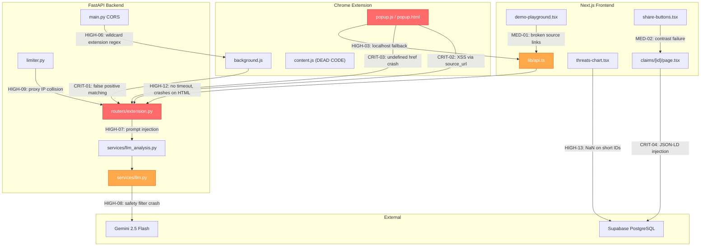

# [FULLY RESOLVED] # 🔍 Prebunk — Complete Codebase Review Report

> **Generated:** August 25, 2026  
> **Scope:** Full audit of `apps/api/`, `apps/extension/`, `apps/web/`, root configs, migrations, scripts, and documentation.  
> **Objective:** Identify every bug, security issue, and improvement opportunity. Provide precise file paths, line numbers, and fix instructions so that any developer can implement them without ambiguity.

---

## Table of Contents

1. [Executive Summary](#1-executive-summary)
2. [CRITICAL Issues (Fix Immediately)](#2-critical-issues)
3. [HIGH Issues (Fix Before Demo/Deploy)](#3-high-issues)
4. [MEDIUM Issues (Fix Soon)](#4-medium-issues)
5. [LOW Issues (Cleanup)](#5-low-issues)
6. [Architecture Diagram of Issues](#6-architecture-diagram-of-issues)

---

## 1. Executive Summary

| Severity     | Count | Primary Impact Areas                                                                 |
| :----------- | :---: | :----------------------------------------------------------------------------------- |
| **CRITICAL** |   4   | False-positive demo matching; XSS in extension; broken script imports; JSON-LD injection |
| **HIGH**     |  17   | Broken links in extension & playground; CORS security; prompt injection; Docker build failure; blocking I/O; rate limiter bypass; broken CI |
| **MEDIUM**   |  15   | Missing error handling; accessibility violations; dead code; stale migrations; SSG failures |
| **LOW**      |  10   | Code style; unused imports; dead UI components; documentation drift                  |

---

## 2. CRITICAL Issues

### CRIT-01: Demo Matching Triggers on ANY Short Word
- **File:** `apps/api/routers/extension.py` — Lines 47, 76
- **Problem:** The condition `normalized_input in normalized_demo_1` checks if the user's input is a *substring* of the demo text. If a user highlights a single common word like `"who"`, `"they"`, `"a"`, `"peace"`, `"Islam"`, or `"society"` on any webpage, it matches because that word exists inside the long demo paragraph. The API returns a hardcoded 100% match for virtually any English word.
- **Impact:** Massive false positives. Any single-word or short-phrase selection triggers a full prebunk response.
- **Fix:**
  ```python
  # REPLACE lines 47 and 76 with length-guarded, one-directional matching:
  
  # Line 47 — only match if input is substantial AND contains the demo text
  if len(normalized_input) >= 50 and normalized_demo_1 in normalized_input:
  
  # Line 76 — same fix
  if len(normalized_input) >= 20 and demo_text_2.lower() in normalized_input:
  ```
  This ensures only near-complete pastes of the demo text trigger the hardcoded response, not single words.

---

### CRIT-02: XSS via Unvalidated `source_url` in Extension
- **File:** `apps/extension/popup.js` — Line 96
- **Problem:** `a.href = ref.source_url;` directly assigns whatever URL the API returns. If a response contains `javascript:alert(1)`, clicking the link executes arbitrary JavaScript within the extension's side-panel origin context.
- **Impact:** Arbitrary code execution inside the extension.
- **Fix:**
  ```javascript
  // In popup.js, add a URL sanitizer function at the top:
  function sanitizeUrl(url) {
    if (!url || typeof url !== 'string') return null;
    try {
      const parsed = new URL(url);
      return (parsed.protocol === 'http:' || parsed.protocol === 'https:') ? parsed.href : null;
    } catch { return null; }
  }

  // Then in the refutation rendering loop (around line 93-104):
  const safeUrl = sanitizeUrl(ref.source_url);
  if (safeUrl) {
    const a = document.createElement('a');
    a.href = safeUrl;
    a.target = "_blank";
    a.rel = "noopener noreferrer";
    a.textContent = ref.source_name || safeUrl;
    li.appendChild(a);
  } else {
    li.textContent = ref.source_name || "Verified Source";
  }
  ```

---

### CRIT-03: Missing `source_url` Crashes Extension Navigation
- **File:** `apps/extension/popup.js` — Line 96
- **File:** `apps/api/routers/extension.py` — Lines 64-71
- **Problem:** The hardcoded Demo-001 refutation object has no `source_url` field. When `popup.js` renders `a.href = ref.source_url`, it becomes `a.href = "undefined"`, which resolves to `chrome-extension://<id>/undefined`. Clicking it navigates to an extension 404 error page.
- **Impact:** Extension crashes on click for demo responses.
- **Fix (Backend):** Add `source_url` to the demo refutation in `apps/api/routers/extension.py` line 64-71:
  ```python
  refutations=[
      {
          "claim": "Immigrants refuse to integrate into European societies.",
          "refutation": "A comprehensive study by the Bertelsmann Stiftung found...",
          "source_name": "Bertelsmann Stiftung Integration Study",
          "source_url": "https://www.bertelsmann-stiftung.de/en/our-projects/religion-monitor",
          "source_type": "academic"
      }
  ]
  ```
- **Fix (Frontend):** Also apply the CRIT-02 fix above to handle missing URLs gracefully.

---

### CRIT-04: JSON-LD Script Injection on Claim Detail Pages
- **File:** `apps/web/src/app/claims/[id]/page.tsx` — Line 89
- **Problem:** `dangerouslySetInnerHTML={{ __html: JSON.stringify(jsonLd) }}` does not escape closing script tags. If a claim's `description` or `title` contains `</script><script>alert(1)</script>`, it breaks out of the JSON-LD block and executes arbitrary JavaScript.
- **Impact:** Stored XSS if malicious data is seeded into the claims database.
- **Fix:**
  ```tsx
  // Replace line 89 with:
  dangerouslySetInnerHTML={{ __html: JSON.stringify(jsonLd).replace(/</g, "\\u003c") }}
  ```

---

## 3. HIGH Issues

### HIGH-01: Broken Import in `scripts/compute_embeddings.py`
- **File:** `apps/api/scripts/compute_embeddings.py` — Line 7
- **Problem:** `from services.embeddings import embed_text` — the file `services/embeddings.py` was deleted. Running this script crashes immediately with `ModuleNotFoundError`.
- **Fix:** Delete this script entirely (embeddings are no longer used).

### HIGH-02: Broken Import in `scripts/reseed_embeddings.py`
- **File:** `scripts/reseed_embeddings.py` — Line 8
- **Problem:** Same as HIGH-01. References deleted `services.embeddings`.
- **Fix:** Delete this script. Also delete `scripts/alter_table.py` (references a nonexistent Supabase RPC function).

### HIGH-03: Extension Links Default to `http://localhost:3000`
- **File:** `apps/extension/popup.js` — Lines 111-122
- **Problem:** `const webUrl = res.webUrl || "http://localhost:3000"`. For any real user, `webUrl` is undefined in storage. Clicking "See full refutation" or "Browse all known claims" navigates to localhost, which fails.
- **Fix:** Change the fallback:
  ```javascript
  const webUrl = res.webUrl || "https://prebunk.vercel.app";
  ```

### HIGH-04: Extension Hides Claim Description for Database Matches
- **File:** `apps/extension/popup.js` — Line 57
- **Problem:** `explanationContainer.classList.add('hidden')` when `is_llm_generated` is `false`. Database claims contain rich descriptions explaining the trope, but the UI deliberately hides them, showing only the script and talking points.
- **Fix:**
  ```javascript
  // Replace lines 55-59 with:
  if (result.claim && result.claim.description) {
    explanationText.textContent = result.claim.description;
    explanationContainer.classList.remove('hidden');
  } else {
    explanationContainer.classList.add('hidden');
  }
  ```

### HIGH-05: Trailing Slash Corrupts API URLs
- **File:** `apps/extension/background.js` — Line 38
- **Problem:** If a user enters `https://example.com/` in settings, the request goes to `https://example.com//extension/analyze` (double slash). FastAPI returns 404 or a redirect that drops the POST body.
- **Fix:**
  ```javascript
  // After line 35, add:
  const cleanUrl = (result.apiUrl || "https://prebunk-api-nctr.onrender.com").replace(/\/+$/, "");
  // Then use cleanUrl instead of API_BASE_URL
  ```

### HIGH-06: CORS Allows ANY Chrome Extension
- **File:** `apps/api/main.py` — Lines 20-21
- **Problem:** `allow_origin_regex=r"chrome-extension://.*"` combined with `allow_credentials=True` allows any malicious extension to make credentialed requests to the API.
- **Fix:** Either restrict to your specific extension ID or set `allow_credentials=False`.

### HIGH-07: Prompt Injection — XML Tag Breakout
- **File:** `apps/api/services/llm_analysis.py` — Lines 22-37
- **Problem:** If user input contains `</user_submitted_text>`, it breaks out of the XML delimiter boundary in the prompt. The 4-pattern regex blacklist is trivially bypassed.
- **Fix:**
  ```python
  # In sanitize_input(), add after existing patterns:
  text = text.replace("</user_submitted_text>", "&lt;/user_submitted_text&gt;")
  ```
  Additionally, pass `SYSTEM_PROMPT` via Gemini's `system_instruction` parameter instead of concatenating it into the user message.

### HIGH-08: Gemini Safety Filters Crash the Server
- **File:** `apps/api/services/llm.py` — Lines 34-40
- **Problem:** When Gemini safety filters trigger (very likely given Prebunk analyzes hate speech), `response.text` can be `None`, causing `re.search(..., None)` to raise `AttributeError`.
- **Fix:**
  ```python
  # Before accessing response.text, add:
  if not response.candidates or not response.candidates[0].content or not response.candidates[0].content.parts:
      logger.warning("Gemini returned empty/blocked response")
      return "{}"
  text = response.text or ""
  ```

### HIGH-09: Rate Limiter Treats All Users as One Behind Proxy
- **File:** `apps/api/limiter.py` — Line 4
- **Problem:** `get_remote_address` reads `request.client.host`. Behind Render/Cloudflare, this is the proxy's IP. All global users share one rate-limit bucket of 10 req/min.
- **Fix:** Implement a custom key function using `X-Forwarded-For` or `CF-Connecting-IP` headers.

### HIGH-10: `docker-compose.yml` Web Build Fails
- **File:** `docker-compose.yml` — Lines 11-12
- **Problem:** Build context `./apps/web` doesn't contain `pnpm-workspace.yaml`, so `COPY pnpm-workspace.yaml ./` in the Dockerfile fails.
- **Fix:**
  ```yaml
  web:
    build:
      context: .
      dockerfile: apps/web/Dockerfile
  ```

### HIGH-11: Config `env_file` Path Breaks in Docker
- **File:** `apps/api/config.py` — Line 4
- **Problem:** `env_file="../../.env"` is relative to CWD. In Docker (`WORKDIR /app`), this resolves to `/.env` (root of filesystem).
- **Fix:**
  ```python
  from pathlib import Path
  ROOT_ENV = Path(__file__).resolve().parent.parent.parent / ".env"
  model_config = SettingsConfigDict(env_file=ROOT_ENV, ...)
  ```

### HIGH-12: `fetchApi` Crashes on Non-JSON Error Responses
- **File:** `apps/web/src/lib/api.ts` — Lines 18-22
- **Problem:** When Render returns an HTML 502 error page, `response.json()` throws an unhandled `SyntaxError`. No request timeout exists, so requests hang indefinitely during cold starts.
- **Fix:**
  ```typescript
  // Wrap response parsing:
  if (!response.ok) {
    let errorMsg = `API request failed: ${response.status} ${response.statusText}`;
    try { const errData = await response.json(); errorMsg = errData.detail || errorMsg; } catch {}
    throw new Error(errorMsg);
  }
  // Add timeout:
  const controller = new AbortController();
  const timeout = setTimeout(() => controller.abort(), 15000);
  ```

### HIGH-13: `ThreatsChart` Crashes on Short Claim IDs
- **File:** `apps/web/src/components/claims/threats-chart.tsx` — Line 43
- **Problem:** `claim.id.charCodeAt(6)` returns `NaN` when `id` has fewer than 7 characters (e.g., demo IDs like `"DEMO-1"`). `NaN` propagates into the chart data, breaking Recharts rendering.
- **Fix:**
  ```typescript
  // Replace charCodeAt(6) with a full-string hash:
  const idHash = claim.id.split("").reduce((acc, char) => acc + char.charCodeAt(0), 0);
  val += Math.sin(idHash * (i + 1) * 15) * 12;
  ```

### HIGH-14: GitHub Actions CI is Broken
- **File:** `.github/workflows/ci.yml`
- **Problem:** CI uses `cd apps/web && pnpm install` (ignores root lockfile) and never runs `pytest` for the API.
- **Fix:** Use `pnpm install --frozen-lockfile` from root, then `pnpm --filter web build`. Add a pytest step with `pip install -r apps/api/requirements.txt && cd apps/api && pytest`.

### HIGH-15: `pnpm dev` Command Doesn't Exist
- **File:** `package.json` — root
- **Problem:** README tells users to run `pnpm dev`, but only `dev:web` and `dev:api` scripts exist. `pnpm dev` fails with `ERR_PNPM_NO_SCRIPT`.
- **Fix:** Add `"dev": "pnpm dev:web"` to root `package.json`.

### HIGH-16: Pydantic Model Missing Defaults Crash on Null DB Fields
- **File:** `apps/api/models/claim.py` — Lines 25-29
- **Problem:** Fields like `refutations: list[Refutation]` and `talking_points: list[str]` have no defaults. If the DB returns `null` for these columns, Pydantic raises `ValidationError` → HTTP 500.
- **Fix:**
  ```python
  refutations: list[Refutation] = []
  talking_points: list[str] = []
  personal_script: Optional[str] = None
  semantic_anchors: list[str] = []
  ```

### HIGH-17: Extension `host_permissions` Blocks `localhost`
- **File:** `apps/extension/manifest.json` — Line 6
- **Problem:** `host_permissions` includes `http://127.0.0.1:8000/*` but NOT `http://localhost:8000/*`. Chrome treats these as different origins. Local dev using `localhost` is silently blocked.
- **Fix:** Add `"http://localhost:8000/*"` to the `host_permissions` array.

---

## 4. MEDIUM Issues

### MED-01: DemoPlayground Renders Broken Links
- **File:** `apps/web/src/components/landing/demo-playground.tsx` — Lines 150-154
- **Problem:** `<a href={ref.source_url}>` renders `<a href="undefined">` when `source_url` is missing from the demo fixture response.
- **Fix:** Conditionally render the link:
  ```tsx
  {ref.source_url ? (
    <a href={ref.source_url} target="_blank" rel="noreferrer" className="...">
      <span>{ref.source_name}</span>
    </a>
  ) : (
    <span className="...">{ref.source_name}</span>
  )}
  ```

### MED-02: Share Buttons Fail WCAG AA Contrast
- **File:** `apps/web/src/components/claims/share-buttons.tsx` — Lines 56, 67, 78
- **Problem:** WhatsApp `#25D366` (2.05:1), Telegram `#0088cc` (3.42:1), Reddit `#FF4500` (3.01:1) all fail the 4.5:1 minimum contrast ratio.
- **Fix:** Use darker variants: WhatsApp `#128C7E`, Telegram `#006699`, Reddit `#D93A00`.

### MED-03: Footer `#extension` Link Broken from Subpages
- **File:** `apps/web/src/components/home/site-footer.tsx` — Line 20
- **Problem:** `href="#extension"` doesn't navigate back to the homepage from `/claims` or `/privacy`.
- **Fix:** Change to `href="/#extension"`.

### MED-04: Content Invisible Without JavaScript
- **File:** `apps/web/src/components/landing/scroll-reveal.tsx` + `globals.css`
- **Problem:** `.scroll-reveal` sets `opacity: 0` by default. If JS fails to load, the entire page is invisible.
- **Fix:** Add a `<noscript>` style block or a CSS-only fallback.

### MED-05: Claims Search Ignores `claim_text`
- **File:** `apps/web/src/components/claims/claims-client.tsx` — Lines 16-20
- **Problem:** Search filters only match `title` and `description`, missing the actual `claim_text` and `semantic_anchors` fields.
- **Fix:** Add `claim.claim_text.toLowerCase().includes(...)` to the filter.

### MED-06: Category Dropdown Sorts "All" Alphabetically
- **File:** `apps/web/src/components/claims/claims-client.tsx` — Line 13
- **Problem:** `.sort()` places `"All"` alphabetically among other categories instead of first.
- **Fix:** Sort categories separately, then prepend "All":
  ```typescript
  const sorted = Array.from(new Set(claims.map(c => c.category))).sort();
  const categories = ["All", ...sorted];
  ```

### MED-07: `/privacy` Missing from Sitemap
- **File:** `apps/web/src/app/sitemap.ts` — Lines 16-20
- **Fix:** Add `{ url: "https://prebunk.vercel.app/privacy", ... }`.

### MED-08: Missing `metadataBase` in Root Layout
- **File:** `apps/web/src/app/layout.tsx`
- **Problem:** Next.js emits warnings about resolving social images without `metadataBase`.
- **Fix:** Add `metadataBase: new URL("https://prebunk.vercel.app")` to the metadata export.

### MED-09: Empty Loading State
- **File:** `apps/web/src/app/loading.tsx`
- **Problem:** Returns an empty `<div>` with `aria-hidden="true"`. No visual feedback for users.
- **Fix:** Add a spinner or skeleton loader.

### MED-10: Context Menu Duplicate Registration
- **File:** `apps/extension/background.js` — Lines 1-7
- **Problem:** `chrome.contextMenus.create` without `removeAll()` throws on extension reload.
- **Fix:** Wrap in `chrome.contextMenus.removeAll(() => chrome.contextMenus.create({...}))`.

### MED-11: `content.js` Does Nothing
- **File:** `apps/extension/content.js` — Lines 1-5
- **Problem:** Injected into every webpage via `<all_urls>` but only logs to console.
- **Fix:** Remove `content_scripts` from `manifest.json` and delete `content.js`.

### MED-12: Unused `supabase` Import in Extension Router
- **File:** `apps/api/routers/extension.py` — Line 4
- **Problem:** `from db import supabase` is imported but never used (SBERT was removed).
- **Fix:** Remove the import.

### MED-13: Unused `threshold` Parameter
- **File:** `apps/api/routers/extension.py` — Line 11
- **Problem:** `threshold: float = Field(default=0.55, ...)` is accepted but never used.
- **Fix:** Remove the field from `AnalyzeRequest` or document its deprecation.

### MED-14: 10 Obsolete Supabase Migrations
- **File:** `supabase/migrations/00002_*` through `00011_*`
- **Problem:** These create 9 tables that are immediately `DROP TABLE CASCADE`'d by `20001_create_claims.sql`.
- **Fix:** Consolidate into a clean baseline: keep `00001` (extensions) and `20001` (claims).

### MED-15: `.gitignore` Doesn't Cover `.env.*` Variants
- **File:** `.gitignore` — Lines 2-3
- **Problem:** Only `.env` and `.env.local` are ignored. Files like `.env.production` or `.env.staging` would be tracked.
- **Fix:**
  ```gitignore
  .env*
  !.env.example
  ```

---

## 5. LOW Issues

### LOW-01: Unused UI Components
- **Files:** `apps/web/src/components/ui/dialog.tsx`, `select.tsx`, `separator.tsx`, `skeleton.tsx`, `tabs.tsx`
- **Problem:** Installed but never imported anywhere. Dead code.
- **Fix:** Remove unused components.

### LOW-02: Misplaced Import in Extension Router
- **File:** `apps/api/routers/extension.py` — Line 30
- **Problem:** `from limiter import limiter` is in the middle of model definitions.
- **Fix:** Move to top of file with other imports.

### LOW-03: Unused `json` Import in LLM Service
- **File:** `apps/api/services/llm.py` — Line 3
- **Fix:** Remove `import json`.

### LOW-04: `bg-grid-pattern` CSS Class Undefined
- **File:** `apps/web/src/components/landing/hero.tsx` — Line 9
- **Problem:** Class `bg-grid-pattern` is used but never defined.
- **Fix:** Either define it in `globals.css` or remove it.

### LOW-05: Deprecated `version` in docker-compose
- **File:** `docker-compose.yml` — Line 1
- **Fix:** Remove `version: '3.8'`.

### LOW-06: Error Log References "Railway" Instead of "Render"
- **Files:** `apps/web/src/app/page.tsx` Line 25, `apps/web/src/app/claims/page.tsx` Line 15
- **Problem:** Console warning says "Railway deployment" but the API is deployed on Render.
- **Fix:** Change to "Make sure NEXT_PUBLIC_API_URL is set to your actual deployment URL."

### LOW-07: Hardcoded GitHub URL
- **Files:** `apps/extension/popup.html` Line 64, `apps/web/src/components/home/extension-promo.tsx` Line 39
- **Fix:** Use a configurable project URL or relative path.

### LOW-08: Extension Icon Brand Color Mismatch
- **File:** `apps/extension/icons/generate_icons.py` — Line 8
- **Problem:** Icons use gold `#B8860B` while the app brand is green `#2F6F4E`.
- **Fix:** Update the icon fill color.

### LOW-09: Non-Semantic Settings Button
- **File:** `apps/extension/popup.html` — Line 14
- **Problem:** `<a href="#">` instead of `<button>` for the settings gear.
- **Fix:** Use `<button id="settings-link" aria-label="Settings">&#9881;</button>`.

### LOW-10: `mobile.md` Stale After Implementation
- **File:** `mobile.md`
- **Problem:** The plan has been fully implemented; line references are now outdated.
- **Fix:** Add a note at the top: "✅ All changes implemented. This document is archived."

---

## 6. Architecture Diagram of Issues



---

## Summary Checklist

- [ ] **CRIT-01:** Fix demo substring matching in `extension.py:47,76` — add length guard
- [ ] **CRIT-02:** Sanitize `source_url` in `popup.js:96` — validate protocol
- [ ] **CRIT-03:** Add `source_url` to demo fixtures in `extension.py:64-71`
- [ ] **CRIT-04:** Escape JSON-LD in `claims/[id]/page.tsx:89`
- [ ] **HIGH-01/02:** Delete broken scripts (`compute_embeddings.py`, `reseed_embeddings.py`, `alter_table.py`)
- [ ] **HIGH-03:** Change extension `webUrl` fallback to `https://prebunk.vercel.app`
- [ ] **HIGH-04:** Show claim description for database matches in `popup.js`
- [ ] **HIGH-05:** Strip trailing slashes from API URL in `background.js`
- [ ] **HIGH-06:** Restrict CORS `allow_origin_regex` in `main.py`
- [ ] **HIGH-07:** Escape `</user_submitted_text>` in `llm_analysis.py`
- [ ] **HIGH-08:** Guard against `None` response in `llm.py`
- [ ] **HIGH-09:** Fix rate limiter key function in `limiter.py`
- [ ] **HIGH-10:** Fix `docker-compose.yml` build context
- [ ] **HIGH-11:** Fix `config.py` env_file path resolution
- [ ] **HIGH-12:** Add timeout and non-JSON handling to `api.ts`
- [ ] **HIGH-13:** Fix `charCodeAt(6)` crash in `threats-chart.tsx`
- [ ] **HIGH-14:** Fix GitHub Actions CI pipeline
- [ ] **HIGH-15:** Add `"dev"` script to root `package.json`
- [ ] **HIGH-16:** Add Pydantic field defaults in `models/claim.py`
- [ ] **HIGH-17:** Add `http://localhost:8000/*` to extension `host_permissions`
- [ ] **MED-01 through MED-15:** Address all medium-severity items
- [ ] **LOW-01 through LOW-10:** Clean up all low-severity items
