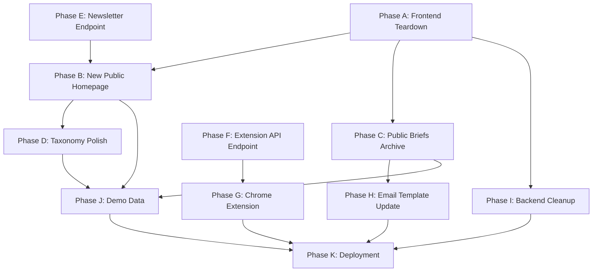

# PLAN2.md — Prebunk Product Pivot & Extension Implementation Plan

> **Status:** Pending user approval before any implementation begins.
>
> **Context:** This plan captures the strategic pivot discussed between the user and the development agent, informed by the GNCI Harvest Hackathon workshop briefing (`workshop.md`) and the existing codebase (`PLAN.md`, Phase 0–10). The product is being restructured from a gated B2B SaaS dashboard into a publicly accessible data-journalism tracker, with a new Chrome Extension feature.

---

## Table of Contents

1. [Product Vision & Positioning](#1-product-vision--positioning)
2. [Architecture Overview](#2-architecture-overview)
3. [Phase A — Frontend Teardown: Remove Auth & Dashboard Shell](#3-phase-a--frontend-teardown-remove-auth--dashboard-shell)
4. [Phase B — New Public Homepage](#4-phase-b--new-public-homepage)
5. [Phase C — Public Briefs Archive Page](#5-phase-c--public-briefs-archive-page)
6. [Phase D — Taxonomy Pages (Keep & Polish)](#6-phase-d--taxonomy-pages-keep--polish)
7. [Phase E — Newsletter Subscribe (Replace Accounts)](#7-phase-e--newsletter-subscribe-replace-accounts)
8. [Phase F — Backend: New Extension Analyze Endpoint](#8-phase-f--backend-new-extension-analyze-endpoint)
9. [Phase G — Chrome Extension](#9-phase-g--chrome-extension)
10. [Phase H — Email Digest Template Update](#10-phase-h--email-digest-template-update)
11. [Phase I — Backend Cleanup & Dead Code Removal](#11-phase-i--backend-cleanup--dead-code-removal)
12. [Phase J — Demo Data & Verification](#12-phase-j--demo-data--verification)
13. [Phase K — Final Deployment & Submission Prep](#13-phase-k--final-deployment--submission-prep)
14. [Dependency Graph](#14-dependency-graph)
15. [Files Inventory: What Changes](#15-files-inventory-what-changes)

---

## 1. Product Vision & Positioning

### The Problem (from workshop.md)

The hackathon briefing identifies that **"the biggest gap sits between a report being filed and a real decision being made"** and that **"coded hate slips through keyword filters."** The Tell MAMA case study defines success as: **"verified intelligence reaching the right people before the next wave."**

### The Pivot

The current product forces users through a login, presents 7 confusing dashboard tabs (Radar, Trends, Briefs, Alerts, Tips, Generate, Settings), and is positioned as an enterprise tool for organizations. This is:

- **Confusing** — a new visitor cannot understand what the product does without creating an account.
- **Inaccessible** — the value is locked behind authentication that provides no real benefit.
- **Overwhelming** — too many options distract from the core story: *see the threat, read the prebunk, share it.*

### The New Vision

Prebunk becomes a **public narrative tracker** — a freely accessible website that anyone can visit to see which anti-Muslim narratives are currently spiking and read the AI-generated educational counter-messaging. No login required.

Additionally, a **Chrome Extension** lets users highlight suspicious text anywhere on the web and instantly get a fact-based response they can copy and share.

### Build Principle (from workshop.md)

> **For** anyone encountering anti-Muslim misinformation online — community members, educators, journalists, or allies
> **who** need immediate access to verified intelligence about current hate narratives and ready-to-use factual responses
> **we will build** a public narrative tracker website and browser extension that surfaces rising threats and provides one-click inoculation content
> **so that** individuals can identify, understand, and respond to coordinated misinformation before it hardens into belief

### Alignment with GNCI Framework

| GNCI Principle | How Prebunk Addresses It |
|---|---|
| **"Before spread"** — verify rumours, add friction | The live tracker surfaces narratives *before* they peak. The extension adds friction at the point of consumption. |
| **"Keep time, source and movement together"** | The VRS trend chart shows the trajectory over time with velocity data. |
| **"Choose one decisive moment and make the next action clearer"** | The extension gives the user a copy-pasteable response at the exact moment they encounter hate content. |
| **"Pick one gap and close it with one practice"** | Gap: "Coded hate slips through keyword filters." Practice: "Semantic matching (SBERT) against a curated taxonomy." |

---

## 2. Architecture Overview

### New Site Map

```
/                       → Public homepage (live tracker + latest briefs + newsletter CTA)
/briefs                 → Public archive of all generated inoculation briefs
/briefs/[id]            → Individual brief detail page (public)
/taxonomy               → Public narrative encyclopedia (already exists, stays public)
/taxonomy/[id]          → Individual narrative detail page (already exists, stays public)
```

### Removed Routes

```
/login                  → DELETED
/register               → DELETED
/dashboard              → DELETED (entire directory)
/dashboard/trends       → DELETED (chart functionality moves to homepage)
/dashboard/briefs       → DELETED (moves to /briefs)
/dashboard/briefs/[id]  → DELETED (moves to /briefs/[id])
/dashboard/alerts       → DELETED
/dashboard/generate     → DELETED (admin only, moved to hidden route or removed)
/dashboard/tips         → DELETED
/dashboard/settings     → DELETED
/auth/callback          → DELETED
/auth/signout           → DELETED
```

### New Artifacts

```
apps/extension/         → Chrome Extension (NEW directory)
├── manifest.json
├── popup.html
├── popup.css
├── popup.js
├── background.js
├── content.js
└── icons/
    ├── icon16.png
    ├── icon48.png
    └── icon128.png
```

### Backend Changes Summary

| Change | Type |
|---|---|
| `POST /extension/analyze` | NEW endpoint |
| `POST /newsletter/subscribe` | NEW endpoint |
| `POST /subscribers/` | KEEP (repurposed for newsletter-only) |
| `PATCH /subscribers/{id}/approve` | REMOVE |
| `PATCH /subscribers/{id}/preferences` | REMOVE |
| `GET /subscribers/user/{user_id}` | REMOVE |
| `POST /tips/` | REMOVE |
| `GET /tips/` | REMOVE |
| `POST /digest/send` | KEEP |
| All other endpoints | KEEP as-is |

---

## 3. Phase A — Frontend Teardown: Remove Auth & Dashboard Shell

### Objective
Strip out all authentication-gated routing, the Supabase auth flow, the dashboard layout shell (sidebar, header, mobile nav), and all pages that required login.

### Reason
The user explicitly stated: *"instead of them making an account on our website they can sign in to our mail list or something like that, I don't think having an account is any useful here."* The entire auth system adds complexity without value for a public-facing tracker.

### Current Implementation
- `apps/web/src/proxy.ts` — Next.js proxy that intercepts all requests, checks Supabase auth session, and redirects unauthenticated users away from protected routes.
- `apps/web/src/lib/supabase/middleware.ts` — `updateSession()` function that refreshes tokens and enforces public path allowlist (`/`, `/login`, `/register`, `/auth`).
- `apps/web/src/lib/supabase/server.ts` — Server-side Supabase client factory (used by `dashboard/layout.tsx` to call `supabase.auth.getUser()`).
- `apps/web/src/lib/supabase/client.ts` — Browser-side Supabase client factory (used by login and register pages).
- `apps/web/src/app/login/page.tsx` — 105-line client component with `signInWithPassword`.
- `apps/web/src/app/register/page.tsx` — 141-line client component with `signUp` + subscriber creation.
- `apps/web/src/app/auth/callback/route.ts` — OAuth callback route handler.
- `apps/web/src/app/auth/signout/route.ts` — Sign-out route handler.
- `apps/web/src/app/dashboard/layout.tsx` — Layout that calls `supabase.auth.getUser()` and `redirect("/login")` if no user.
- `apps/web/src/components/layout/sidebar.tsx` — 7-item nav sidebar.
- `apps/web/src/components/layout/header.tsx` — User email display + sign-out form.
- `apps/web/src/components/layout/mobile-nav.tsx` — Mobile slide-out drawer with 7 nav items.
- `apps/web/src/components/layout/nav-link.tsx` — Active-link helper.

### Target Implementation
All of the above files are deleted. The proxy is replaced with a no-op or removed entirely. No Supabase auth is used anywhere in the frontend. The site is fully public.

### Files Affected

| Action | File |
|---|---|
| DELETE | `apps/web/src/proxy.ts` |
| DELETE | `apps/web/src/lib/supabase/middleware.ts` |
| DELETE | `apps/web/src/lib/supabase/server.ts` |
| DELETE | `apps/web/src/lib/supabase/client.ts` |
| DELETE | `apps/web/src/app/login/page.tsx` |
| DELETE | `apps/web/src/app/register/page.tsx` |
| DELETE | `apps/web/src/app/auth/callback/route.ts` |
| DELETE | `apps/web/src/app/auth/signout/route.ts` |
| DELETE | `apps/web/src/app/dashboard/layout.tsx` |
| DELETE | `apps/web/src/app/dashboard/page.tsx` |
| DELETE | `apps/web/src/app/dashboard/loading.tsx` |
| DELETE | `apps/web/src/app/dashboard/error.tsx` |
| DELETE | `apps/web/src/app/dashboard/trends/page.tsx` |
| DELETE | `apps/web/src/app/dashboard/briefs/page.tsx` |
| DELETE | `apps/web/src/app/dashboard/briefs/[id]/page.tsx` |
| DELETE | `apps/web/src/app/dashboard/alerts/page.tsx` |
| DELETE | `apps/web/src/app/dashboard/generate/page.tsx` |
| DELETE | `apps/web/src/app/dashboard/tips/page.tsx` |
| DELETE | `apps/web/src/app/dashboard/settings/page.tsx` |
| DELETE | `apps/web/src/components/layout/sidebar.tsx` |
| DELETE | `apps/web/src/components/layout/header.tsx` |
| DELETE | `apps/web/src/components/layout/mobile-nav.tsx` |
| DELETE | `apps/web/src/components/layout/nav-link.tsx` |
| DELETE | `apps/web/src/components/dashboard/forecast-overlay.tsx` |
| DELETE | `apps/web/src/components/dashboard/trends-interactive.tsx` |
| DELETE | `apps/web/src/components/dashboard/alert-card.tsx` |
| DELETE | `apps/web/src/components/dashboard/stat-widget.tsx` |
| DELETE | `apps/web/src/components/dashboard/radar-chart.tsx` |
| DELETE | `apps/web/src/components/dashboard/narrative-card.tsx` |
| DELETE | `apps/web/src/components/settings/settings-form.tsx` |
| DELETE | `apps/web/src/components/tips/tip-submission-form.tsx` |
| DELETE | `apps/web/src/components/dashboard/brief-actions.tsx` |

### Implementation Steps

1. Delete every file listed in the table above.
2. Delete the entire `apps/web/src/app/dashboard/` directory (recursively).
3. Delete the entire `apps/web/src/app/login/` directory.
4. Delete the entire `apps/web/src/app/register/` directory.
5. Delete the entire `apps/web/src/app/auth/` directory.
6. Delete the entire `apps/web/src/components/layout/` directory.
7. Delete the entire `apps/web/src/components/settings/` directory.
8. Delete the entire `apps/web/src/components/tips/` directory.
9. Delete `apps/web/src/proxy.ts`.
10. Delete `apps/web/src/lib/supabase/` directory entirely.
11. Remove the `@supabase/ssr` and `@supabase/supabase-js` packages from `apps/web/package.json` dependencies.
12. Verify the app builds without errors: `cd apps/web && npm run build`.

### Dependencies
- None. This phase can be executed first.

### Edge Cases
- Any components in `apps/web/src/components/dashboard/` that are reused by the new public pages (specifically `trend-chart.tsx`, `brief-card.tsx`, `brief-filters.tsx`, `vrs-badge.tsx`, `brief-content-display.tsx`) must NOT be deleted. They will be moved or kept in place. See Phase B and Phase C for details.

### Testing / Acceptance Criteria
- `npm run build` succeeds with zero errors.
- Navigating to `/login`, `/register`, `/dashboard`, or `/auth/callback` results in a 404.
- No `@supabase/ssr` or `@supabase/supabase-js` imports remain in the frontend codebase.
- No `supabase.auth` calls remain anywhere in the frontend.

---

## 4. Phase B — New Public Homepage

### Objective
Rebuild the root page (`/`) as a unified, scrolling public homepage that tells the entire Prebunk story in a single view: what it is, what's spiking right now, and how to get the prebunk.

### Reason
The user stated: *"Instead of having a whole thing for organisations and stuff, we just keep the website for anyone"* and *"the point of the product is to be able to convey that, tackling a misinformation before it gets embedded too deep into people's mind."* The new homepage must immediately communicate the value proposition without any clicks or navigation.

### Current Implementation
- `apps/web/src/app/page.tsx` (43 lines) — Renders `<Hero />`, `<HowItWorks />`, `<Features />` static marketing sections. Links to `/login` and `/register`.
- `apps/web/src/components/landing/hero.tsx` (26 lines) — Headline: "A weather radar for Islamophobia." CTAs: "Browse the Taxonomy" and "Dashboard Login".
- `apps/web/src/components/landing/how-it-works.tsx` (45 lines) — 3-step pipeline: Monitor, Forecast, Inoculate.
- `apps/web/src/components/landing/features.tsx` (41 lines) — 4 feature cards.

### Target Implementation
The page becomes a server component that fetches live data and renders 5 sections in a single scrollable view:

#### Section 1: Header / Navigation Bar
A simple top bar with:
- Left: Shield icon + "PREBUNK" brand
- Right: Navigation links → "Briefs", "Taxonomy", "Get the Extension"

No login/register links.

#### Section 2: Hero
- **Headline:** "Stop the lie before it goes viral."
- **Subheading:** "Prebunk tracks coordinated anti-Muslim misinformation in real time. See what's rising now — and get the facts before the narrative peaks."
- **Primary CTA:** "See What's Trending ↓" (anchor link scrolling to Section 3)
- **Secondary CTA:** "Get the Chrome Extension" (anchor link to extension download / CWS link)

#### Section 3: Live Narrative Tracker
A data-driven section that replaces the old Trends page and Radar page. It is a server component that fetches:
- `GET /narratives/` — all narratives
- `GET /vrs/?latest=false` — full VRS history for charting
- `GET /clusters/` — cluster names

It renders:
1. **Section title:** "Live Threat Tracker" with a subtitle: "Velocity Risk Scores for the top narratives over the past 7 days."
2. **A single `TrendChart` component** showing the top 5 narratives by current VRS score as multi-line time series. This reuses the existing `TrendChart` component from `apps/web/src/components/dashboard/trend-chart.tsx` (66 lines), but without the forecast overlay feature (that complexity is removed).
3. **Below the chart:** A row of 3–5 small cards showing the top narratives with their name, cluster, current VRS score (using `VrsBadge`), and acceleration indicator. Each card links to `/taxonomy/[id]` so users can learn more.

**Data transformation:** The page performs the same grouping logic currently in `apps/web/src/app/dashboard/trends/page.tsx`: group VRS scores by date, build chart data, identify top 5 narratives by latest score, and pass to the chart.

#### Section 4: Latest Inoculation Briefs
A data-driven section that replaces the old Briefs page:
1. **Section title:** "Latest Inoculation Briefs" with subtitle: "AI-generated educational content ready to share."
2. **Fetches:** `GET /briefs/` from the API.
3. **Renders:** The 3 most recent briefs as `BriefCard` components (reused from existing code). Each links to `/briefs/[id]`.
4. **"View All Briefs →"** link at the bottom navigating to `/briefs`.

#### Section 5: Newsletter CTA + Footer
A section replacing the old registration/settings flow:
1. **Section title:** "Stay Ahead of the Narrative"
2. **Subtitle:** "Subscribe to our weekly digest — the top threats, the facts, and what you can say."
3. **Email input field + "Subscribe" button.** This calls `POST /newsletter/subscribe` (new endpoint, see Phase E).
4. **Success/error state handling** in the UI (inline message below the input).
5. **Footer:** Hackathon branding, copyright, link to taxonomy and extension.

### Files Affected

| Action | File |
|---|---|
| REWRITE | `apps/web/src/app/page.tsx` |
| REWRITE | `apps/web/src/components/landing/hero.tsx` |
| REWRITE | `apps/web/src/components/landing/how-it-works.tsx` |
| DELETE | `apps/web/src/components/landing/features.tsx` |
| NEW | `apps/web/src/components/home/live-tracker.tsx` |
| NEW | `apps/web/src/components/home/latest-briefs.tsx` |
| NEW | `apps/web/src/components/home/newsletter-form.tsx` |
| NEW | `apps/web/src/components/home/site-header.tsx` |
| NEW | `apps/web/src/components/home/site-footer.tsx` |
| KEEP | `apps/web/src/components/dashboard/trend-chart.tsx` (move to `components/charts/`) |
| KEEP | `apps/web/src/components/dashboard/vrs-badge.tsx` (move to `components/ui/`) |
| KEEP | `apps/web/src/components/dashboard/brief-card.tsx` (move to `components/briefs/`) |

### Implementation Steps

1. Create `apps/web/src/components/home/` directory.
2. Create `site-header.tsx` — simple nav bar component. No auth, no sidebar. Links: Home, Briefs, Taxonomy, Extension.
3. Create `site-footer.tsx` — footer component with hackathon branding and links.
4. Rewrite `hero.tsx` with the new headline copy. Remove all `/login` and `/register` links. Primary CTA becomes an anchor link (`#tracker`). Secondary CTA links to extension.
5. Rewrite `how-it-works.tsx`. Keep the 3-step pipeline (Monitor → Forecast → Inoculate) but update the copy to reflect the public-facing framing. Remove any language about "organizations" or "coordinators."
6. Create `live-tracker.tsx` — a server component that:
   - Accepts `narratives`, `vrsScores`, and `clusters` as props.
   - Computes chart data by grouping VRS scores by date (same logic as current `trends/page.tsx`).
   - Identifies top 5 narratives by latest VRS score.
   - Renders a `TrendChart` with the data.
   - Renders a row of small narrative summary cards below the chart with VrsBadge and link to `/taxonomy/[id]`.
7. Create `latest-briefs.tsx` — accepts `briefs: Brief[]` as props, renders the 3 most recent using `BriefCard`, and a "View All →" link to `/briefs`.
8. Create `newsletter-form.tsx` — a `"use client"` component with:
   - State: `email: string`, `status: 'idle' | 'loading' | 'success' | 'error'`, `message: string`.
   - On submit: `POST` to `${API_BASE_URL}/newsletter/subscribe` with `{ email }`.
   - On success: display "You're subscribed! Check your inbox for a confirmation."
   - On error: display the error message from the API.
9. Rewrite `apps/web/src/app/page.tsx`:
   - Make it an `async` server component.
   - Fetch `narratives`, `vrsScores` (with `?latest=false`), `clusters`, and `briefs` from the API.
   - Render: `<SiteHeader />` → `<Hero />` → `<HowItWorks />` → `<LiveTracker />` → `<LatestBriefs />` → `<NewsletterForm />` → `<SiteFooter />`.
10. Move reusable components out of `components/dashboard/`:
    - `trend-chart.tsx` → `components/charts/trend-chart.tsx`
    - `vrs-badge.tsx` → `components/ui/vrs-badge.tsx`
    - `brief-card.tsx` → `components/briefs/brief-card.tsx`
    - Update all imports accordingly.
11. Delete `apps/web/src/components/landing/features.tsx` (replaced by the live data sections).

### Dependencies
- Phase A must be complete (dashboard shell removed, no proxy interference).
- Phase E must be complete for the newsletter form to work (backend endpoint).

### Data/API Changes
- The homepage calls the same existing API endpoints: `GET /narratives/`, `GET /vrs/?latest=false`, `GET /clusters/`, `GET /briefs/`.
- One new call: `POST /newsletter/subscribe` (defined in Phase E).

### UI/UX Behavior
- The page is fully server-rendered for SEO and fast first paint.
- Only `newsletter-form.tsx` is a client component (for form interactivity).
- The trend chart is client-side rendered (Recharts requires `"use client"`), wrapped in the existing pattern.
- On mobile, the navigation collapses to a hamburger menu or a simplified horizontal scroll of links.

### Edge Cases
- **No VRS data:** If `GET /vrs/?latest=false` returns an empty array, the Live Tracker section should display a message: "No tracking data available yet. Check back soon."
- **No briefs:** If `GET /briefs/` returns an empty array, the Latest Briefs section should display: "No briefs generated yet."
- **API unreachable:** If any fetch fails, the page should degrade gracefully: show the static sections (Hero, HowItWorks) and display an error card where the data sections would be.

### Error/Loading/Empty States
- **Loading:** Not applicable — the page is server-rendered. Next.js will show the loading state from `loading.tsx` (a new root-level loading file should be created with a simple spinner/skeleton).
- **Empty:** Handled per-section as described above.
- **Error:** Use Next.js `error.tsx` at the root `app/` level to catch fetch failures.

### Acceptance Criteria
- Visiting `/` shows a complete, scrolling page with live data from the API.
- The trend chart renders with the top 5 narratives.
- The latest briefs section shows up to 3 briefs with links to `/briefs/[id]`.
- The newsletter form submits successfully and shows a confirmation message.
- No references to "login," "register," "dashboard," or "organization" appear anywhere on the page.

---

## 5. Phase C — Public Briefs Archive Page

### Objective
Create a new public `/briefs` route (and `/briefs/[id]` detail route) that replaces the old dashboard-gated briefs pages.

### Reason
Inoculation briefs are the core output of Prebunk. They must be publicly accessible so anyone can read and share them.

### Current Implementation
- `apps/web/src/app/dashboard/briefs/page.tsx` — Fetches `GET /briefs/`, renders `BriefArchiveInteractive` (filter buttons + BriefCard grid). Requires authentication.
- `apps/web/src/app/dashboard/briefs/[id]/page.tsx` — Fetches `GET /briefs/{id}`, renders metadata + `BriefContentDisplay`. Requires authentication.
- `apps/web/src/components/dashboard/brief-filters.tsx` — Client component with filter buttons (`all`, `on_demand`, `scheduled`, `alert`) and BriefCard grid.
- `apps/web/src/components/brief/brief-content-display.tsx` — Renders the 6 structured sections of a brief (summary, technique, context, talking points, personal script, questions).

### Target Implementation
New pages at `apps/web/src/app/briefs/page.tsx` and `apps/web/src/app/briefs/[id]/page.tsx` that are publicly accessible (no auth check). They reuse the existing `BriefCard`, `brief-filters`, and `BriefContentDisplay` components.

### Files Affected

| Action | File |
|---|---|
| NEW | `apps/web/src/app/briefs/page.tsx` |
| NEW | `apps/web/src/app/briefs/[id]/page.tsx` |
| KEEP | `apps/web/src/components/briefs/brief-card.tsx` (moved in Phase B) |
| MOVE | `apps/web/src/components/dashboard/brief-filters.tsx` → `apps/web/src/components/briefs/brief-filters.tsx` |
| KEEP | `apps/web/src/components/brief/brief-content-display.tsx` |

### Implementation Steps

1. Create `apps/web/src/app/briefs/page.tsx`:
   - Async server component.
   - Fetches `GET /briefs/` from API.
   - Renders `SiteHeader`, page title ("Inoculation Briefs"), subtitle, `BriefArchiveInteractive`, and `SiteFooter`.
   - No auth check.
2. Create `apps/web/src/app/briefs/[id]/page.tsx`:
   - Async server component.
   - Fetches `GET /briefs/{id}` from API.
   - Renders `SiteHeader`, back link to `/briefs`, brief metadata (date, validation status, language), `BriefContentDisplay`, and `SiteFooter`.
   - No auth check.
   - Include a "Copy Response" button (client component) that copies the `personal_script` to the clipboard.
3. Move `apps/web/src/components/dashboard/brief-filters.tsx` to `apps/web/src/components/briefs/brief-filters.tsx`. Update the import path for `BriefCard`.
4. Update `BriefCard` links from `/dashboard/briefs/${brief.id}` to `/briefs/${brief.id}`.

### Dependencies
- Phase A (dashboard deletion).
- Phase B (SiteHeader/SiteFooter components exist).

### Edge Cases
- **Brief not found:** If `GET /briefs/{id}` returns 404, show a friendly "Brief not found" page with a link back to `/briefs`.
- **No briefs at all:** The archive page shows "No briefs have been generated yet. Check back soon."

### Acceptance Criteria
- `/briefs` is publicly accessible and shows all generated briefs in a filterable grid.
- `/briefs/[id]` shows the full brief content including all 6 sections.
- No authentication required.
- Links from homepage and taxonomy correctly navigate to these pages.

---

## 6. Phase D — Taxonomy Pages (Keep & Polish)

### Objective
Keep the existing `/taxonomy` and `/taxonomy/[id]` pages public, but update their navigation to match the new site structure and remove references to the old dashboard.

### Reason
The taxonomy browser is already public and is a core feature. It just needs updated navigation.

### Current Implementation
- `apps/web/src/app/taxonomy/page.tsx` — Fetches narratives, renders `TaxonomyList`. Has a "Dashboard" link in the header.
- `apps/web/src/app/taxonomy/[id]/page.tsx` — Detail page with a "Generate Brief" CTA linking to `/dashboard/generate?narrative={id}`. Uses hardcoded dark-theme emerald/sky CSS classes for refutations and inoculation hooks.

### Target Implementation
- Replace the custom header in both taxonomy pages with `<SiteHeader />`.
- Remove the "Dashboard" link.
- Change the "Generate Brief" CTA on the detail page:
  - If a brief already exists for this narrative, link to `/briefs/[brief_id]` with label "Read the Prebunk".
  - If no brief exists, remove the CTA entirely (brief generation is now automated/admin-only).
- Fix the hardcoded dark-theme colors in `taxonomy/[id]/page.tsx` (emerald-950, sky-950, slate-700, etc.) to use the semantic CSS variable system (`bg-muted`, `text-muted-foreground`, `border-border`).

### Files Affected

| Action | File |
|---|---|
| MODIFY | `apps/web/src/app/taxonomy/page.tsx` |
| MODIFY | `apps/web/src/app/taxonomy/[id]/page.tsx` |

### Implementation Steps

1. In `taxonomy/page.tsx`:
   - Replace the inline `<header>` block (lines 14–26) with `<SiteHeader />`.
   - Remove the `Shield`, `ArrowLeft` lucide imports if unused after the change.
2. In `taxonomy/[id]/page.tsx`:
   - Replace the inline `<header>` block (lines 29–39) with `<SiteHeader />`.
   - Remove the "Generate Brief" `<Link>` and "Requires dashboard access" text (lines 58–66).
   - Replace hardcoded dark-theme classes:
     - `bg-emerald-950/20` → `bg-emerald-50` (light mode equivalent)
     - `border-emerald-900/30` → `border-emerald-200`
     - `text-emerald-100` → `text-emerald-900`
     - `text-emerald-200/80` → `text-emerald-700`
     - `text-emerald-500/80` → `text-emerald-600`
     - `bg-sky-950/20` → `bg-sky-50`
     - `border-sky-900/50` → `border-sky-200`
     - `text-sky-200` → `text-sky-900`
     - `border-l-sky-500` → `border-l-primary`
     - `hover:bg-slate-700` → `hover:bg-muted`
   - Remove the `border-slate-900` class from the grid separator and replace with `border-border`.

### Dependencies
- Phase B (SiteHeader component exists).

### Acceptance Criteria
- Both taxonomy pages render correctly with the new header.
- No "Dashboard" or "Generate Brief" references.
- No hardcoded dark-theme color classes remain.
- Existing search and filter functionality on the taxonomy list still works.

---

## 7. Phase E — Newsletter Subscribe (Replace Accounts)

### Objective
Create a lightweight email subscription system that replaces the complex account/subscriber registration flow.

### Reason
The user stated: *"instead of them making an account on our website they can sign in to our mail list or something like that."* The full Supabase auth + subscriber profile + approval workflow is replaced with a simple email-only newsletter signup.

### Current Implementation (Backend)
- `apps/api/routers/subscribers.py` — 4 endpoints:
  - `POST /subscribers/` — Creates a subscriber with `user_id`, `org_name`, `org_type`, `country`, `language_preference`, `tier`, `contact_email`, `team_size`. Requires a Supabase user ID.
  - `PATCH /subscribers/{id}/approve` — Admin approval.
  - `PATCH /subscribers/{id}/preferences` — Update notification prefs.
  - `GET /subscribers/user/{user_id}` — Lookup by Supabase user ID.
- `apps/api/models/subscriber.py` — `Subscriber` model with 13 fields, `SubscriberCreate` with 8 fields.

### Target Implementation (Backend)

#### New Endpoint: `POST /newsletter/subscribe`

Create a new router `apps/api/routers/newsletter.py` with a single endpoint:

**Request:**
```json
{
  "email": "user@example.com"
}
```

**Behavior:**
1. Validate that `email` is a non-empty string containing `@`.
2. Check if a subscriber with this `contact_email` already exists in the `subscribers` table.
3. If it already exists and `status` is `approved`, return `{"status": "already_subscribed", "message": "This email is already subscribed."}` with HTTP 200.
4. If it does not exist, insert a new row into `subscribers` with:
   - `org_name`: "Newsletter Subscriber"
   - `org_type`: "individual"
   - `contact_email`: the provided email
   - `status`: "approved" (auto-approved — no manual approval for newsletter)
   - `tier`: "individual"
   - `language_preference`: "en"
   - `delivery_frequency`: "weekly"
   - `user_id`: `null` (no Supabase auth)
   - `focus_clusters`: `[]`
5. Return `{"status": "subscribed", "message": "You're subscribed! You'll receive our weekly digest."}` with HTTP 201.

**Response (success):**
```json
{
  "status": "subscribed",
  "message": "You're subscribed! You'll receive our weekly digest."
}
```

**Response (duplicate):**
```json
{
  "status": "already_subscribed",
  "message": "This email is already subscribed."
}
```

**Response (validation error):**
```json
{
  "detail": "A valid email address is required."
}
```
HTTP 422.

#### Keep Existing Subscriber Infrastructure
The `subscribers` table and the `digest` router remain unchanged. The weekly digest email system (`POST /digest/send`) continues to query `subscribers` where `status = 'approved'` and send emails. The new newsletter signups flow directly into this same table and are auto-approved, so they receive digests automatically.

### Files Affected

| Action | File |
|---|---|
| NEW | `apps/api/routers/newsletter.py` |
| MODIFY | `apps/api/main.py` (register new router) |
| MODIFY | `apps/api/routers/subscribers.py` (keep `POST /subscribers/` for backward compat, remove the 3 other endpoints) |

### Implementation Steps

1. Create `apps/api/routers/newsletter.py`:
   - Define `NewsletterRequest(BaseModel)` with `email: str`.
   - Define `NewsletterResponse(BaseModel)` with `status: str`, `message: str`.
   - Implement `POST /newsletter/subscribe` with the logic above.
   - Use `from db import supabase` and `from fastapi import APIRouter, HTTPException`.
2. Register the router in `apps/api/main.py`:
   - Add `from routers import newsletter`.
   - Add `app.include_router(newsletter.router)`.
3. Simplify `apps/api/routers/subscribers.py`:
   - Remove the `approve_subscriber`, `update_preferences`, and `get_subscriber_by_user_id` functions.
   - Keep `POST /subscribers/` for backward compatibility (the digest builder uses it).

### Dependencies
- None. This can be implemented independently.

### Security Considerations
- **Rate limiting:** The newsletter endpoint is publicly exposed without auth. Add a basic check: if the same email is submitted more than 3 times in 5 minutes, return HTTP 429. This prevents spam. (Implementation: simple in-memory dict with timestamps, cleared periodically.)
- **Email validation:** Use a basic regex or Pydantic `EmailStr` type to validate the email format.
- **No PII exposure:** The endpoint never returns subscriber IDs or other subscriber data.

### Acceptance Criteria
- `POST /newsletter/subscribe` with a valid email creates a new approved subscriber row.
- Duplicate emails return a friendly "already subscribed" message instead of an error.
- Invalid emails return HTTP 422.
- The weekly digest (`POST /digest/send`) successfully sends to newsletter subscribers.

---

## 8. Phase F — Backend: New Extension Analyze Endpoint

### Objective
Create a new API endpoint that the Chrome Extension calls to analyze highlighted text and return matching narratives with their prebunk content.

### Reason
The extension needs to send arbitrary text to the backend, get it semantically matched against the narrative taxonomy, and receive back the matched narrative's inoculation content (talking points, personal script) so the user can copy-paste a response.

### Current Implementation
- `POST /briefs/match` already exists in `apps/api/routers/briefs.py`. It accepts `{"text": "...", "threshold": 0.45}` and returns `list[NarrativeMatch]` (narrative_id, narrative_name, similarity_score). However, it does NOT return the prebunk content — only the match metadata.
- `services/matcher.py` contains `match_text()` and `match_texts()` which perform SBERT cosine similarity against cached narrative embeddings.

### Target Implementation

#### New Endpoint: `POST /extension/analyze`

Create a new router `apps/api/routers/extension.py`.

**Request:**
```json
{
  "text": "Muslims are secretly replacing the native population...",
  "threshold": 0.40
}
```

**Behavior:**
1. Call `match_text(text, threshold)` from `services/matcher.py`.
2. If no matches found, return an empty result.
3. For the top match (highest similarity score):
   a. Fetch the narrative from `narratives` table to get `name`, `description`, `cluster_id`, `technique_id`, `inoculation_hook`, `talking_points`.
   b. Fetch the most recent brief for this narrative from `briefs` table where `validation_outcome = 'passed'`, ordered by `created_at DESC`, limit 1.
   c. If a brief exists, extract `content.personal_script` and `content.talking_points`.
   d. If no brief exists, use the narrative's own `talking_points` and `inoculation_hook` as fallback.
4. Return the structured response.

**Response (match found):**
```json
{
  "matched": true,
  "narrative": {
    "id": "NAR-003",
    "name": "The Great Replacement",
    "description": "Claims that Muslim immigration...",
    "cluster_id": "CLU-01",
    "similarity_score": 0.78
  },
  "prebunk": {
    "personal_script": "When someone says...",
    "talking_points": ["Point 1", "Point 2", "Point 3"],
    "inoculation_hook": "This narrative uses the...",
    "brief_id": "uuid-of-brief-if-exists"
  }
}
```

**Response (no match):**
```json
{
  "matched": false,
  "narrative": null,
  "prebunk": null
}
```

### Files Affected

| Action | File |
|---|---|
| NEW | `apps/api/routers/extension.py` |
| MODIFY | `apps/api/main.py` (register new router) |

### Implementation Steps

1. Create `apps/api/routers/extension.py`:
   - Define Pydantic models: `AnalyzeRequest(text: str, threshold: float = 0.40)`, `NarrativeResult(id, name, description, cluster_id, similarity_score)`, `PrebunkResult(personal_script, talking_points, inoculation_hook, brief_id)`, `AnalyzeResponse(matched: bool, narrative: NarrativeResult | None, prebunk: PrebunkResult | None)`.
   - Implement `POST /extension/analyze`.
   - Import `match_text` from `services.matcher`.
   - Import `supabase` from `db`.
2. Register the router in `main.py`:
   - `from routers import extension`
   - `app.include_router(extension.router)`
3. Add CORS: Ensure `settings.cors_origins` includes `chrome-extension://*` or use `allow_origins=["*"]` (already the case since `allow_methods=["*"]` and `allow_headers=["*"]` are set, but verify `cors_origins` in `.env` or `config.py` permits extension origins). Chrome extensions from Manifest V3 use `fetch()` which respects CORS. The simplest approach is to add `"chrome-extension://*"` to the allowed origins list, or alternatively set `allow_origin_regex=r"chrome-extension://.*"` in the CORS middleware.

### Dependencies
- None for the backend. The extension (Phase G) depends on this endpoint.

### Performance Considerations
- SBERT model loading is lazy and cached. First request may take 5–10 seconds to load the model. Subsequent requests use the cached model.
- Narrative embeddings are cached for 1 hour (`CACHE_TTL = 3600` in matcher.py).
- The endpoint should respond within 1–2 seconds for a typical text query after model warm-up.

### Edge Cases
- **Empty text:** Return `{"matched": false, ...}` immediately without calling SBERT.
- **Very long text (>10,000 chars):** Truncate to first 512 tokens before embedding (SBERT models have a max sequence length of 384 tokens for `all-mpnet-base-v2`). This prevents unnecessary computation.
- **No narratives in database:** `match_text` returns an empty list. Return `{"matched": false}`.
- **Narrative has no brief and no talking points:** Return `prebunk.talking_points` as an empty list and `prebunk.personal_script` as `null`.

### Acceptance Criteria
- `POST /extension/analyze` with text matching a known narrative returns `matched: true` with the correct narrative and prebunk content.
- `POST /extension/analyze` with unrelated text returns `matched: false`.
- The endpoint responds within 2 seconds after model warm-up.
- CORS headers allow requests from Chrome extensions.

---

## 9. Phase G — Chrome Extension

### Objective
Build a Chrome Extension (Manifest V3) that lets users highlight text on any webpage, right-click or click the extension icon, and see whether the text matches a known anti-Muslim narrative — with a one-click copy of a factual response.

### Reason
The user proposed: *"How about we also create an extension which identifies the islamophobic content on the current page and maybe generates the appropriate response for it?"* This turns Prebunk from a passive tracker into an active tool that protects users at the point of consumption.

### Current Implementation
No extension exists. The `apps/extension/` directory does not exist.

### Target Implementation

#### Directory Structure
```
apps/extension/
├── manifest.json
├── popup.html
├── popup.css
├── popup.js
├── background.js
├── content.js
└── icons/
    ├── icon16.png
    ├── icon48.png
    └── icon128.png
```

#### manifest.json
```json
{
  "manifest_version": 3,
  "name": "Prebunk — Spot the Lie",
  "version": "1.0.0",
  "description": "Highlight suspicious text and instantly get a fact-based response. Powered by Prebunk's anti-misinformation taxonomy.",
  "permissions": ["contextMenus", "activeTab", "storage"],
  "host_permissions": ["<API_BASE_URL>/*"],
  "background": {
    "service_worker": "background.js"
  },
  "content_scripts": [
    {
      "matches": ["<all_urls>"],
      "js": ["content.js"]
    }
  ],
  "action": {
    "default_popup": "popup.html",
    "default_icon": {
      "16": "icons/icon16.png",
      "48": "icons/icon48.png",
      "128": "icons/icon128.png"
    }
  },
  "icons": {
    "16": "icons/icon16.png",
    "48": "icons/icon48.png",
    "128": "icons/icon128.png"
  }
}
```

#### User Flow

1. **Highlight text** on any webpage (e.g., a tweet, a Reddit comment, a news article excerpt).
2. **Right-click** → "Prebunk this text" context menu option (registered in `background.js`).
3. The extension popup opens showing a **loading state**: "Analyzing..."
4. `background.js` sends the highlighted text to `POST /extension/analyze`.
5. **If matched:**
   - Popup displays: "⚠️ Known Trope Detected" with the narrative name.
   - Shows the similarity score as a percentage.
   - Displays the personal script in a card.
   - Displays talking points as a bulleted list.
   - A **"Copy Response"** button copies the `personal_script` to the clipboard.
   - A **"Learn More"** link opens the Prebunk website at `/taxonomy/[narrative_id]`.
6. **If not matched:**
   - Popup displays: "✅ No known anti-Muslim tropes detected in this text."
   - A note: "This doesn't mean the content is harmless — only that it doesn't match our current taxonomy."

#### background.js
- On install, create a context menu item: `chrome.contextMenus.create({ id: "prebunk-analyze", title: "Prebunk this text", contexts: ["selection"] })`.
- On context menu click, get the selected text from `info.selectionText`.
- Store it in `chrome.storage.local.set({ selectedText: info.selectionText, analysisResult: null, status: "loading" })`.
- Call `POST /extension/analyze` with the text.
- On response, store the result: `chrome.storage.local.set({ analysisResult: response, status: "done" })`.
- On error, store: `chrome.storage.local.set({ analysisResult: null, status: "error", errorMessage: "..." })`.
- Open the popup programmatically (or let the user click the icon).

#### content.js
- Listens for the right-click context menu selection.
- Minimal logic — the heavy lifting is in `background.js` and `popup.js`.
- Optionally: detect when text is selected and show a small floating "Prebunk" tooltip button near the selection. Clicking it triggers the analysis (same as right-click). This is a UX enhancement.

#### popup.html / popup.js / popup.css
- `popup.js` reads from `chrome.storage.local` to get the analysis status and result.
- Renders the appropriate UI state:
  - **Idle (no text analyzed yet):** "Select text on any webpage, right-click, and choose 'Prebunk this text' to analyze."
  - **Loading:** Spinner + "Analyzing text against our taxonomy..."
  - **Match found:** Warning banner + narrative name + score + personal script card + talking points + Copy button + Learn More link.
  - **No match:** Success banner with explanatory note.
  - **Error:** Error message with retry suggestion.
- **Copy Response button:** Uses `navigator.clipboard.writeText()` to copy the personal script. Changes button text to "Copied!" for 2 seconds.

#### popup.css
- Clean, light theme matching the main website's editorial palette (`#FAFAF8` background, `#1A1A1A` text, `#B8860B` gold accent).
- Fixed width: 380px. Max height: 500px with scroll.
- Cards with subtle borders (`#E5E5E0`).
- The extension popup should feel like a miniature version of the main website.

#### Icons
- Generate 3 PNG icons (16x16, 48x48, 128x128) featuring a shield icon in the brand gold color (`#B8860B`) on a white/light background.

### Files Affected

| Action | File |
|---|---|
| NEW | `apps/extension/manifest.json` |
| NEW | `apps/extension/popup.html` |
| NEW | `apps/extension/popup.css` |
| NEW | `apps/extension/popup.js` |
| NEW | `apps/extension/background.js` |
| NEW | `apps/extension/content.js` |
| NEW | `apps/extension/icons/icon16.png` |
| NEW | `apps/extension/icons/icon48.png` |
| NEW | `apps/extension/icons/icon128.png` |

### Implementation Steps

1. Create `apps/extension/` directory.
2. Create `manifest.json` with Manifest V3 configuration.
3. Create `background.js`:
   - Register context menu on install.
   - Handle context menu click: store selected text, call API, store result.
   - Handle API URL from `chrome.storage.sync` (with a default fallback to `http://127.0.0.1:8000`).
4. Create `content.js` — minimal, listens for messages from background.
5. Create `popup.html` — semantic HTML structure with sections for each state.
6. Create `popup.css` — styled to match the Prebunk brand.
7. Create `popup.js`:
   - On load, read `chrome.storage.local` for status and result.
   - Render the appropriate UI.
   - Attach click handler to "Copy Response" button.
   - Attach click handler to "Learn More" link.
   - Listen for storage changes to update the UI reactively.
8. Generate icon PNGs (can use a simple canvas script or design tool).

### Dependencies
- Phase F (the `POST /extension/analyze` endpoint must exist).

### Security Considerations
- The extension only sends the user's highlighted text to the Prebunk API. No browsing history, cookies, or other data is collected.
- The `host_permissions` should be limited to only the Prebunk API domain (not `<all_urls>`).
- Content script injection is minimal — no DOM manipulation of the host page beyond the optional floating button.

### Testing
- Load the extension unpacked in Chrome via `chrome://extensions` → "Load unpacked" → select `apps/extension/`.
- Navigate to any webpage with known Islamophobic content or paste a test string.
- Highlight the text, right-click, select "Prebunk this text."
- Verify the popup shows the correct match result.
- Verify the Copy button works.
- Verify the Learn More link opens the correct taxonomy page.

### Acceptance Criteria
- Extension loads without errors in Chrome.
- Right-click context menu appears when text is selected.
- Analysis returns correct results for known taxonomy narratives.
- "Copy Response" copies the personal script to clipboard.
- "Learn More" opens the correct `/taxonomy/[id]` page.
- "No match" state displays correctly for unrelated text.
- Extension popup is visually consistent with the main website brand.

---

## 10. Phase H — Email Digest Template Update

### Objective
Update the weekly digest HTML email template to match the new brand and remove references to the dashboard.

### Reason
The email template (`apps/api/templates/weekly_digest.html`) uses a dark theme (`#020617` background, `#0f172a` container) and links to `/dashboard`. The website is now light-themed (`#FAFAF8`) and the dashboard no longer exists.

### Current Implementation
- `apps/api/templates/weekly_digest.html` (75 lines) — Dark-themed HTML email with links to `{{ base_url }}/dashboard`, `{{ base_url }}/dashboard/settings`, and `{{ base_url }}/dashboard/briefs/{{ main_brief.id }}`.

### Target Implementation
- Update the color scheme to match the editorial light theme (white background, dark text, gold accents).
- Change all links:
  - `{{ base_url }}/dashboard` → `{{ base_url }}`
  - `{{ base_url }}/dashboard/settings` → remove (no settings page)
  - `{{ base_url }}/dashboard/briefs/{{ main_brief.id }}` → `{{ base_url }}/briefs/{{ main_brief.id }}`
- Update footer text: remove "Manage your preferences" link. Add "Unsubscribe" placeholder.
- Add a call-to-action for the Chrome Extension: "Get the Prebunk browser extension to fight misinformation in real time."

### Files Affected

| Action | File |
|---|---|
| MODIFY | `apps/api/templates/weekly_digest.html` |

### Implementation Steps

1. Open `apps/api/templates/weekly_digest.html`.
2. Replace the CSS color scheme:
   - `body` background: `#020617` → `#FAFAF8`
   - `body` color: `#f8fafc` → `#1A1A1A`
   - `.container` background: `#0f172a` → `#FFFFFF`
   - `.container` border: `#1e293b` → `#E5E5E0`
   - `.header` border: `#1e293b` → `#E5E5E0`
   - `.header h1` color: `#38bdf8` → `#B8860B`
   - `.narrative-card` background: `#1e293b` → `#F5F5F0`
   - `.narrative-card` border-left: `#38bdf8` → `#B8860B`
   - `.badge` colors: sky-blue tints → gold tints
   - `h2` color: `#e2e8f0` → `#1A1A1A`
   - `.brief-box` background/border: dark sky → light gold
   - `.brief-box h3` color: `#38bdf8` → `#B8860B`
   - `.brief-box p` color: `#cbd5e1` → `#374151`
   - `.footer` color: `#64748b` → `#737373`
   - `a` color: `#38bdf8` → `#B8860B`
   - `ul` color: `#cbd5e1` → `#374151`
   - `p` secondary colors: `#94a3b8` → `#737373`
3. Update all `{{ base_url }}` links as described above.
4. Remove "Manage your preferences" footer link.
5. Add extension CTA block in the footer.

### Dependencies
- Phase C (briefs route must exist at `/briefs/[id]`).

### Acceptance Criteria
- Email renders correctly in a browser preview (open the HTML file directly).
- All links point to valid public routes (no `/dashboard` references).
- Color scheme matches the website's editorial light theme.

---

## 11. Phase I — Backend Cleanup & Dead Code Removal

### Objective
Remove backend endpoints and code that only served the old dashboard's authenticated features.

### Reason
With the dashboard removed, several backend features are no longer called by any frontend and add unnecessary surface area.

### Changes

#### Remove from `apps/api/routers/subscribers.py`
- DELETE `PATCH /subscribers/{id}/approve` — No admin approval flow.
- DELETE `PATCH /subscribers/{id}/preferences` — No settings page.
- DELETE `GET /subscribers/user/{user_id}` — No user lookup.
- KEEP `POST /subscribers/` — Still used by digest system and backward compatibility.

#### Remove `apps/api/routers/tips.py` Entirely
- The community tips feature (`POST /tips/`, `GET /tips/`) was dashboard-only functionality.
- The frontend page and form have been deleted in Phase A.
- Delete the router file and remove it from `main.py`.

#### Remove Tips Registration from `main.py`
- Remove `from routers import tips` and `app.include_router(tips.router)`.

### Files Affected

| Action | File |
|---|---|
| MODIFY | `apps/api/routers/subscribers.py` (remove 3 endpoints) |
| DELETE | `apps/api/routers/tips.py` |
| MODIFY | `apps/api/main.py` (remove tips import/registration) |

### Dependencies
- Phase A (frontend references to these endpoints are gone).

### Acceptance Criteria
- `PATCH /subscribers/{id}/approve` returns 404.
- `GET /subscribers/user/{user_id}` returns 404.
- `GET /tips/` returns 404.
- `POST /newsletter/subscribe` still works.
- `POST /digest/send` still works.
- The API starts without errors.

---

## 12. Phase J — Demo Data & Verification

### Objective
Generate realistic demo data that populates the public homepage with compelling visualizations and content.

### Reason
The tracker needs 7+ days of VRS history to show meaningful trend lines, and at least 3–5 briefs to populate the archive.

### Current Implementation
- `PLAN.md` Phase 11 Step 2 describes a `scripts/generate_demo_data.py` that should exist. Check if it exists; if not, create it.

### Implementation Steps

1. Create (or update) `apps/api/scripts/generate_demo_data.py`:
   - Generate 7 days of backdated `narrative_events` for 5–7 narratives, with realistic daily variation.
   - Generate corresponding `vrs_scores` entries for each day, showing:
     - 2 narratives trending upward (approaching Alert/Critical).
     - 2 narratives stable (Watch range).
     - 1 narrative declining (Monitor range).
   - Generate 3–5 `briefs` for the top narratives with realistic AI-like content in the `content` JSONB field (technique_explanation, narrative_context, talking_points, personal_script, discussion_questions, summary).
   - All data uses existing narrative IDs from the taxonomy.
2. Run the script against the Supabase database.
3. Verify:
   - `GET /vrs/?latest=false` returns data spanning 7 days.
   - `GET /briefs/` returns 3–5 briefs.
   - The homepage trend chart shows meaningful curves.

### Dependencies
- Phases A–E complete (the public homepage can render the data).

### Acceptance Criteria
- The homepage trend chart shows 7 days of data with visible trends.
- The latest briefs section shows 3+ briefs.
- All data is internally consistent (VRS scores correspond to real narrative IDs).

---

## 13. Phase K — Final Deployment & Submission Prep

### Objective
Deploy the rebuilt product and prepare hackathon submission materials.

### Implementation Steps

1. **Update `apps/web/.env.production`** (or `.env.local`) with the production API URL.
2. **Deploy backend to Railway:**
   - Verify `apps/api/Dockerfile` is correct and builds.
   - `railway up` from `apps/api/`.
   - Note the deployed URL.
3. **Deploy frontend to Vercel:**
   - Set `NEXT_PUBLIC_API_URL` to the Railway URL.
   - Remove `NEXT_PUBLIC_SUPABASE_URL` and `NEXT_PUBLIC_SUPABASE_ANON_KEY` from Vercel env vars (no longer needed in frontend).
   - `vercel --prod` from `apps/web/`.
4. **Update `manifest.json`** in the Chrome Extension with the production API URL in `host_permissions`.
5. **Write/Update `README.md`:**
   - Product description aligned with the new public-facing vision.
   - Architecture diagram.
   - Setup instructions (backend, frontend, extension).
   - Demo screenshots.
   - Live URLs.
6. **Write/Update `DISCLOSURES.md`:**
   - All tools and services used.
   - Academic sources for the taxonomy.
   - AI usage disclosure.
7. **Create a 2-minute demo video** showing:
   - Landing on the homepage and seeing live data.
   - Reading an inoculation brief.
   - Using the Chrome Extension on a sample page.
   - Subscribing to the newsletter.

### Dependencies
- All previous phases complete.

### Acceptance Criteria
- Website is live at the Vercel URL with real data.
- API is live at the Railway URL responding to requests.
- Chrome Extension can be loaded unpacked and works against the production API.
- README and DISCLOSURES are complete.

---

## 14. Dependency Graph



**Recommended execution order:**
1. Phase A (Teardown) + Phase E (Newsletter endpoint) + Phase F (Extension endpoint) — can be done in parallel.
2. Phase B (Homepage) — depends on A and E.
3. Phase C (Briefs archive) — depends on A.
4. Phase D (Taxonomy polish) — depends on B.
5. Phase G (Chrome Extension) — depends on F.
6. Phase H (Email template) — depends on C.
7. Phase I (Backend cleanup) — depends on A.
8. Phase J (Demo data) — depends on B, C, D.
9. Phase K (Deployment) — depends on everything.

---

## 15. Files Inventory: What Changes

### Files to DELETE (29 files)

```
apps/web/src/proxy.ts
apps/web/src/lib/supabase/middleware.ts
apps/web/src/lib/supabase/server.ts
apps/web/src/lib/supabase/client.ts
apps/web/src/app/login/page.tsx
apps/web/src/app/register/page.tsx
apps/web/src/app/auth/callback/route.ts
apps/web/src/app/auth/signout/route.ts
apps/web/src/app/dashboard/layout.tsx
apps/web/src/app/dashboard/page.tsx
apps/web/src/app/dashboard/loading.tsx
apps/web/src/app/dashboard/error.tsx
apps/web/src/app/dashboard/trends/page.tsx
apps/web/src/app/dashboard/briefs/page.tsx
apps/web/src/app/dashboard/briefs/[id]/page.tsx
apps/web/src/app/dashboard/alerts/page.tsx
apps/web/src/app/dashboard/generate/page.tsx
apps/web/src/app/dashboard/tips/page.tsx
apps/web/src/app/dashboard/settings/page.tsx
apps/web/src/components/layout/sidebar.tsx
apps/web/src/components/layout/header.tsx
apps/web/src/components/layout/mobile-nav.tsx
apps/web/src/components/layout/nav-link.tsx
apps/web/src/components/dashboard/forecast-overlay.tsx
apps/web/src/components/dashboard/trends-interactive.tsx
apps/web/src/components/dashboard/alert-card.tsx
apps/web/src/components/dashboard/stat-widget.tsx
apps/web/src/components/dashboard/radar-chart.tsx
apps/web/src/components/dashboard/narrative-card.tsx
apps/web/src/components/settings/settings-form.tsx
apps/web/src/components/tips/tip-submission-form.tsx
apps/web/src/components/dashboard/brief-actions.tsx
apps/web/src/components/landing/features.tsx
apps/api/routers/tips.py
```

### Files to CREATE (17 files)

```
apps/web/src/components/home/site-header.tsx
apps/web/src/components/home/site-footer.tsx
apps/web/src/components/home/live-tracker.tsx
apps/web/src/components/home/latest-briefs.tsx
apps/web/src/components/home/newsletter-form.tsx
apps/web/src/app/briefs/page.tsx
apps/web/src/app/briefs/[id]/page.tsx
apps/api/routers/newsletter.py
apps/api/routers/extension.py
apps/extension/manifest.json
apps/extension/popup.html
apps/extension/popup.css
apps/extension/popup.js
apps/extension/background.js
apps/extension/content.js
apps/extension/icons/  (3 PNG files)
```

### Files to MODIFY (9 files)

```
apps/web/src/app/page.tsx                              (rewrite for new homepage)
apps/web/src/app/layout.tsx                            (update metadata)
apps/web/src/components/landing/hero.tsx                (rewrite copy)
apps/web/src/components/landing/how-it-works.tsx        (rewrite copy)
apps/web/src/app/taxonomy/page.tsx                     (update header)
apps/web/src/app/taxonomy/[id]/page.tsx                (update header, remove dark colors)
apps/web/src/components/dashboard/brief-card.tsx        (update link paths, move)
apps/api/main.py                                       (register new routers, remove tips)
apps/api/routers/subscribers.py                        (remove 3 endpoints)
apps/api/templates/weekly_digest.html                  (update theme and links)
apps/web/package.json                                  (remove supabase dependencies)
```

### Files to MOVE/RENAME (3 files)

```
apps/web/src/components/dashboard/trend-chart.tsx       → apps/web/src/components/charts/trend-chart.tsx
apps/web/src/components/dashboard/vrs-badge.tsx         → apps/web/src/components/ui/vrs-badge.tsx
apps/web/src/components/dashboard/brief-card.tsx        → apps/web/src/components/briefs/brief-card.tsx
apps/web/src/components/dashboard/brief-filters.tsx     → apps/web/src/components/briefs/brief-filters.tsx
```

### Files UNCHANGED (kept as-is)

```
apps/api/config.py
apps/api/db.py
apps/api/models/*
apps/api/services/*
apps/api/ingestion/*
apps/api/prompts/*
apps/api/routers/narratives.py
apps/api/routers/vrs.py
apps/api/routers/briefs.py
apps/api/routers/alerts.py
apps/api/routers/ingest.py
apps/api/routers/digest.py
apps/api/routers/forecast.py
apps/api/routers/clusters.py
apps/api/services/email_service.py
apps/web/src/lib/api.ts
apps/web/src/lib/utils.ts
apps/web/src/types/index.ts
apps/web/src/components/ui/*
apps/web/src/components/brief/brief-content-display.tsx
apps/web/src/components/taxonomy/*
```
