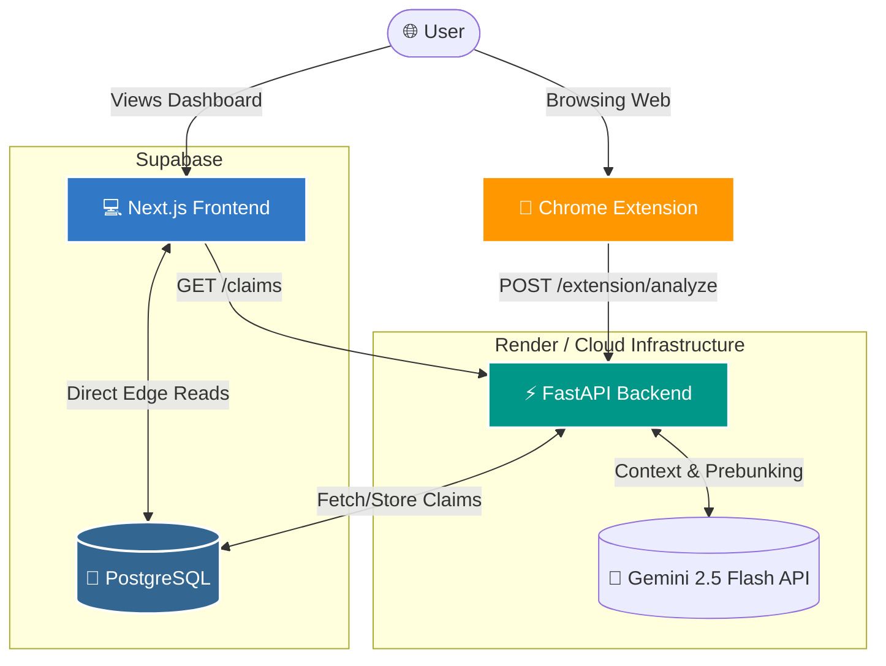

# 🛡️ Prebunk

> A weather radar for Islamophobia. Predict, prebunk, and prepare.

**Prebunk** is an open-source narrative intelligence platform designed to track, analyze, and neutralize emerging anti-Muslim claims, conspiracy theories, and hate speech online *before* they go viral. Utilizing social science-backed **inoculation theory**, Prebunk equips users with factual refutations, context, and ready-to-use scripts to counter online hate speech efficiently.

---

## ✨ Features

- **Real-Time Analysis:** Highlight text anywhere on the web and get an instant, fact-based analysis of underlying dog-whistles or conspiracy theories.
- **Narrative Tracking:** A public dashboard that tracks the velocity of known hate-speech tropes.
- **LLM-Powered Intelligence:** Powered by Google Gemini 2.5 Flash for rapid text classification and contextual understanding.
- **Inoculation Strategy:** Provides "prebunks"—giving users the tools to refute claims logically before the misinformation takes root.

---

## 🏗️ System Architecture

Prebunk is designed as a modern, decoupled monorepo. It features a Next.js frontend, a FastAPI Python backend, and a Chromium extension, all stitched together via a Supabase PostgreSQL database.



### 🧰 Tech Stack
- **Frontend / Dashboard**: [Next.js 14](https://nextjs.org/) (App Router), React, Tailwind CSS, Recharts, Framer Motion.
- **Backend API**: [FastAPI](https://fastapi.tiangolo.com/) (Python), Pydantic, Uvicorn, SlowAPI (Rate Limiting).
- **AI / NLP**: [Google Gemini 2.5 Flash](https://deepmind.google/technologies/gemini/) (via `google-genai` SDK) for lightning-fast zero-shot classification and response generation.
- **Database**: [Supabase](https://supabase.com/) (PostgreSQL) with Row Level Security (RLS).
- **Extension**: Vanilla JavaScript (Manifest V3) for maximum performance and compatibility.
- **Hosting**: Vercel (Frontend) & Render (Backend API).

---

## 🧩 Installing the Browser Extension

The Prebunk browser extension is the primary way users interact with the platform in the wild. Since it is currently in beta, you must install it locally:

1. Open your Chromium-based browser (Chrome, Edge, Brave, etc.).
2. Navigate to `chrome://extensions/` in your URL bar.
3. Toggle **"Developer mode"** ON in the top right corner.
4. Click the **"Load unpacked"** button in the top left.
5. Select the `apps/extension` folder inside this repository.
6. **Important:** Click the newly added Prebunk extension icon in your browser toolbar to open its popup, and ensure the API URL is pointing to your live backend (or `http://127.0.0.1:8000` if running locally).

Now, you can highlight any text on any website, right-click, and select **"Prebunk this text"** to get a real-time factual analysis!

---

## 🚀 Quick Start (Local Development)

### Prerequisites
- [Node.js](https://nodejs.org) (v20+)
- [pnpm](https://pnpm.io) (v11+)
- [Python](https://www.python.org) (3.11+)
- A [Supabase](https://supabase.com) account & [Google Gemini API Key](https://aistudio.google.com/app/apikey)

### 1. Clone & Install
```bash
git clone https://github.com/muaviz/prebunk.git && cd prebunk

# Install Next.js frontend dependencies
pnpm install

# Install Python API dependencies
cd apps/api
python -m venv .venv
source .venv/bin/activate
pip install -r requirements.txt
```

### 2. Configure Environment Variables
Copy the root example environment file:
```bash
cp .env.example .env
```
Fill in your `.env` file with your specific credentials:
- `SUPABASE_URL` & `SUPABASE_SERVICE_ROLE_KEY` (from your Supabase project settings)
- `GEMINI_API_KEY` (from Google AI Studio)

### 3. Initialize the Database
Run the Supabase migrations to set up your tables, then seed the database with the baseline threat claims:
```bash
cd apps/api
python -m scripts.seed_claims
```

### 4. Run the Stack
**Terminal 1: Start the API**
```bash
cd apps/api
source .venv/bin/activate
uvicorn main:app --reload --port 8000
```

**Terminal 2: Start the Web Dashboard**
```bash
pnpm dev
```
Visit `http://localhost:3000` to view the dashboard!

---

## 🧪 Testing

The FastAPI backend includes a suite of tests to verify rate limiting, prompt injection boundaries, and routing logic.
```bash
cd apps/api
pytest
```

---

## 🗺️ Maintenance & Hackathon Roadmap

### 1. Database Maintenance
- **Data Curation:** The claims database is currently seeded from the `data/claims.json` manifest. Post-hackathon, we plan to implement a rigorous review process where community volunteers and OSINT researchers can flag emerging narratives.
- **Source Freshness:** Prebunk uses Supabase edge functions to periodically verify if linked refutation sources (e.g., news articles, academic papers) are still live, flagging dead links for manual review.

### 2. Hackathon Follow-up
- We intend to refine the Google Gemini prompt templates to reduce false positives.
- A public issue tracker will be maintained on GitHub where users can report LLM hallucinations or misclassifications.
- We will seek partnerships with Muslim civil rights organizations (like CAIR or ISPU) to validate and expand our taxonomy of dog whistles.

### 3. API Monitoring & Uptime
- The FastAPI backend is deployed on **Render**, running purely on the Gemini API to maintain a microscopic memory footprint (~50MB) and ensure zero OOM crashes on the free tier.
- We monitor API endpoints via built-in health checks (`/health`).
- `slowapi` handles IP-based rate-limiting to prevent abuse.

---

## 📄 License
This project is licensed under the MIT License.
